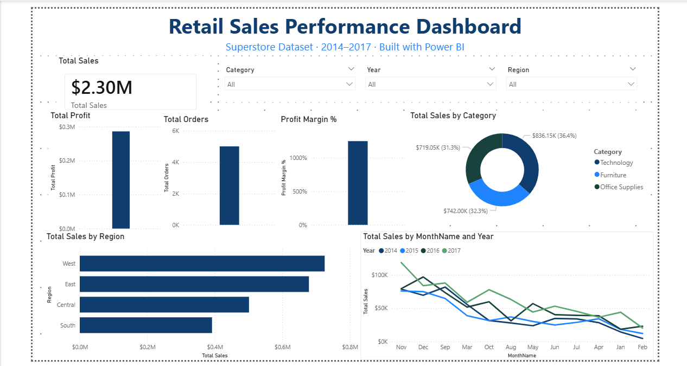

# 📊 Retail Sales Performance Dashboard

A complete end-to-end data analytics project built using **SQL, Python, and Power BI** to analyse retail sales performance, customer behaviour, discount impact, and regional profitability trends.

---

## 🚀 Project Overview

Retail businesses generate massive volumes of transactional data every day. Without proper analysis, identifying profitable products, seasonal trends, and loss-making discount strategies becomes difficult.

This project demonstrates how modern analytics tools can be used together to transform raw sales data into actionable business insights.

The solution includes:

- SQL-based data querying and aggregation
- Python exploratory data analysis (EDA)
- Interactive Power BI dashboard visualisations
- Business-focused insights and recommendations

---

## 🧩 Business Problem

A retail company requires visibility into:

- Regional sales performance
- Product profitability
- Customer segment behaviour
- Seasonal sales trends
- The financial impact of discounts

The goal is to support better business decisions related to:

- Discount strategies
- Inventory planning
- Marketing focus
- Product prioritisation
- Profit optimisation

---

## 🎯 Project Objectives

This project was developed to:

✅ Analyse sales and profit performance across regions and categories  
✅ Identify high-performing and low-performing products  
✅ Discover seasonal purchasing trends  
✅ Evaluate the relationship between discounts and profitability  
✅ Build an interactive dashboard for business stakeholders

---

## 📂 Dataset Information

| Attribute | Details |
|---|---|
| Dataset | Sample Superstore Dataset |
| Source | Kaggle |
| Records | ~10,000 retail orders |
| Time Period | 2014 – 2017 |
| Columns | 21 |

🔗 Dataset Link:  
[Superstore Dataset on Kaggle](https://www.kaggle.com/datasets/vivek468/superstore-dataset-final)

---

## 🛠️ Tools & Technologies

| Tool / Technology | Purpose |
|---|---|
| Microsoft SQL Server | Data storage and aggregation queries |
| Python (pandas, matplotlib, seaborn) | Data cleaning and exploratory analysis |
| Jupyter Notebook | EDA and analysis workflow |
| Power BI Desktop | Interactive dashboard visualisation |
| Git & GitHub | Version control and project hosting |

---

## 📈 Key Business Insights

### 🌍 Regional Performance

- The **West region** generated the highest overall sales revenue.
- The **East region** achieved stronger profit margins.

### 💻 Product Category Analysis

- **Technology** products produced the highest profits.
- Office Supplies generated stable but lower margins.

### 📅 Seasonal Trends

- Sales consistently peaked during **November and December**, indicating strong holiday season demand.

### 💸 Discount Impact

- Orders with discounts above **20%** were frequently unprofitable.
- Excessive discounting significantly reduced overall margins.

### 🪑 Product-Level Findings

- **Phones** and **Chairs** generated the highest sales revenue.
- **Copiers** delivered the highest profit-per-unit.

---

## 📊 Dashboard Preview

### Main Dashboard



---

## 📌 Features Included

- Interactive Power BI visuals
- Regional sales analysis
- Profitability breakdowns
- Discount vs profit analysis
- Seasonal trend visualisations
- Product category performance metrics
- Python EDA notebook
- SQL analysis queries

---

## 🧪 Exploratory Data Analysis (Python)

The Python analysis includes:

- Missing value checks
- Data cleaning
- Descriptive statistics
- Correlation analysis
- Trend analysis
- Visualisations using matplotlib and seaborn

Libraries used:

```python
pandas
matplotlib
seaborn
openpyxl
```

---

## 🗄️ SQL Analysis

SQL Server was used to:

- Aggregate regional sales
- Calculate profitability metrics
- Analyse discount impacts
- Generate KPI-focused business queries

Example business questions answered:

- Which region generates the highest revenue?
- Which product categories are most profitable?
- How do discounts affect profit margins?
- What are the peak sales months?

---

## ▶️ How to Run This Project

### 1️⃣ Clone the Repository

```bash
git clone <repo-url>
```

### 2️⃣ Install Python Dependencies

```bash
pip install -r requirements.txt
```

### 3️⃣ Open the Jupyter Notebook

```bash
jupyter lab
```

Then open:

```text
notebooks/01_EDA_Retail_Sales.ipynb
```

### 4️⃣ Open the Power BI Dashboard

Open:

```text
dashboards/retail_sales_dashboard.pbix
```

using:

- Power BI Desktop

---

## 📁 Project Structure

```text
retail-sales-dashboard/
│
├── data/
│   ├── raw/                 # Original dataset
│   └── processed/           # Cleaned dataset
│
├── notebooks/               # Python EDA notebooks
│
├── sql/                     # SQL queries and scripts
│
├── dashboards/
│   ├── screenshots/         # Dashboard preview images
│   └── retail_sales_dashboard.pbix
│
├── requirements.txt         # Python dependencies
├── README.md                # Project documentation
└── .gitignore
```

---

## 📚 Skills Demonstrated

- Data Cleaning
- Exploratory Data Analysis
- Data Visualisation
- SQL Querying
- Business Intelligence
- Dashboard Design
- Data Storytelling
- Git & GitHub Workflow

---

## 👩‍💻 Author

**Piumi Jayawardene**  
Information Systems Undergraduate

Interested in:

- Data Analytics
- Business Intelligence
- Power BI
- SQL
- Python
- Data Visualisation
- Business Analysis

🔗 LinkedIn:  
[Piumi Jayawardene LinkedIn](https://www.linkedin.com/in/piumi-jayawardene/)

---

## ⭐ If You Found This Useful

Feel free to:

- Star the repository ⭐
- Connect on LinkedIn 🤝
- Share feedback or suggestions 💬

---

## 📌 Future Improvements

Planned future enhancements:

- Predictive sales forecasting
- Customer segmentation analysis
- Advanced KPI dashboards
- Real-time dashboard integration
- Automated ETL pipeline
